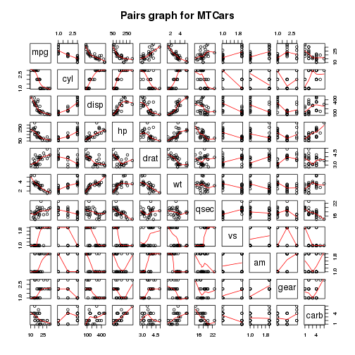
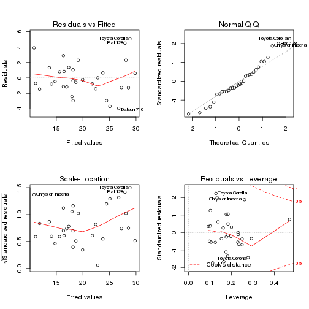

Motor Trends : Automatic or Manual transmission for better mileage ?
========================================================

## Executive summary

In this report we try to answer the question : "Is automatic or manual transmission better for mpg ?". To answer this question we used a dataset from the 1974 Motor Trend US magazine, and ran some statistical tests and a regression analysis. On one hand the statistical tests show (without controlling for other car design features) a difference in mean of about 7 miles more for the manual transmitted cars. On the other hand, the regression analysis indicate that by taking into account other variables like horse power and weight, manual transmitted cars are only 1.8 miles better than automatic transmitted cars and also that this result is not significant.

## Cleaning data

The first step of our analysis is simply to load and take a look at the data.


```r
data(mtcars)
str(mtcars)
```

```
## 'data.frame':	32 obs. of  11 variables:
##  $ mpg : num  21 21 22.8 21.4 18.7 18.1 14.3 24.4 22.8 19.2 ...
##  $ cyl : num  6 6 4 6 8 6 8 4 4 6 ...
##  $ disp: num  160 160 108 258 360 ...
##  $ hp  : num  110 110 93 110 175 105 245 62 95 123 ...
##  $ drat: num  3.9 3.9 3.85 3.08 3.15 2.76 3.21 3.69 3.92 3.92 ...
##  $ wt  : num  2.62 2.88 2.32 3.21 3.44 ...
##  $ qsec: num  16.5 17 18.6 19.4 17 ...
##  $ vs  : num  0 0 1 1 0 1 0 1 1 1 ...
##  $ am  : num  1 1 1 0 0 0 0 0 0 0 ...
##  $ gear: num  4 4 4 3 3 3 3 4 4 4 ...
##  $ carb: num  4 4 1 1 2 1 4 2 2 4 ...
```

```r
summary(mtcars)
```

```
##       mpg            cyl            disp             hp       
##  Min.   :10.4   Min.   :4.00   Min.   : 71.1   Min.   : 52.0  
##  1st Qu.:15.4   1st Qu.:4.00   1st Qu.:120.8   1st Qu.: 96.5  
##  Median :19.2   Median :6.00   Median :196.3   Median :123.0  
##  Mean   :20.1   Mean   :6.19   Mean   :230.7   Mean   :146.7  
##  3rd Qu.:22.8   3rd Qu.:8.00   3rd Qu.:326.0   3rd Qu.:180.0  
##  Max.   :33.9   Max.   :8.00   Max.   :472.0   Max.   :335.0  
##       drat            wt            qsec            vs       
##  Min.   :2.76   Min.   :1.51   Min.   :14.5   Min.   :0.000  
##  1st Qu.:3.08   1st Qu.:2.58   1st Qu.:16.9   1st Qu.:0.000  
##  Median :3.69   Median :3.33   Median :17.7   Median :0.000  
##  Mean   :3.60   Mean   :3.22   Mean   :17.8   Mean   :0.438  
##  3rd Qu.:3.92   3rd Qu.:3.61   3rd Qu.:18.9   3rd Qu.:1.000  
##  Max.   :4.93   Max.   :5.42   Max.   :22.9   Max.   :1.000  
##        am             gear           carb     
##  Min.   :0.000   Min.   :3.00   Min.   :1.00  
##  1st Qu.:0.000   1st Qu.:3.00   1st Qu.:2.00  
##  Median :0.000   Median :4.00   Median :2.00  
##  Mean   :0.406   Mean   :3.69   Mean   :2.81  
##  3rd Qu.:1.000   3rd Qu.:4.00   3rd Qu.:4.00  
##  Max.   :1.000   Max.   :5.00   Max.   :8.00
```


Now we coerce the "cyl", "vs", "gear", "carb" and "am" variables into factor variables.


```r
mtcars$cyl <- factor(mtcars$cyl)
mtcars$vs <- factor(mtcars$vs)
mtcars$gear <- factor(mtcars$gear)
mtcars$carb <- factor(mtcars$carb)
mtcars$am <- factor(mtcars$am)
```


For a better readability, we rename the levels of the "am" variable into "Auto" and "Manual".


```r
levels(mtcars$am) <- c("Auto", "Manual")
```


## Graphics

We begin by plotting boxplots of the variable "mpg" when "am" is "Auto" or "Manual".


```r
plot(mpg ~ am, data = mtcars, main = "Mpg by transmission type", xlab = "Transmission type", 
    ylab = "Miles per gallon")
```

 


The graph above hints at an increase in mpg when gearing was manual but this data may have other variables which may play a bigger role in determination of mpg.

We then plot the relationships between all the variables of the dataset.


```r
pairs(mtcars, panel = panel.smooth, main = "Pairs graph for MTCars")
```

 


We may note that variables like "cyl", "disp", "hp", "drat", "wt", "vs" and "am" seem highky correlated to "mpg".

## Inference

We may also run a some tests to compare the mpg means between automatic and manual transmissions.

### T-test

We begin by using a t-test assuming that the mileage data has a normal distribution.


```r
t.test(mpg ~ am, data = mtcars)
```

```
## 
## 	Welch Two Sample t-test
## 
## data:  mpg by am
## t = -3.767, df = 18.33, p-value = 0.001374
## alternative hypothesis: true difference in means is not equal to 0
## 95 percent confidence interval:
##  -11.28  -3.21
## sample estimates:
##   mean in group Auto mean in group Manual 
##                17.15                24.39
```


The test results clearly shows that the manual and automatic transmissions are significatively different.

### Wilcoxon test

Next we use a nonparametric test to determine if there's a difference in the population means.


```r
wilcox.test(mpg ~ am, data = mtcars)
```

```
## Warning: cannot compute exact p-value with ties
```

```
## 
## 	Wilcoxon rank sum test with continuity correction
## 
## data:  mpg by am
## W = 42, p-value = 0.001871
## alternative hypothesis: true location shift is not equal to 0
```


The Wilcoxon test also rejects the null hypothesis that the mileage data of the manual and automatic transmissions are from the same population (indicating a difference).

## Regression analysis

First we need to select a model, we proceed by using AIC in a stepwise algorithm.


```r
model.all <- lm(mpg ~ ., data = mtcars)
model <- step(model.all, direction = "both")
```

```
## Start:  AIC=76.4
## mpg ~ cyl + disp + hp + drat + wt + qsec + vs + am + gear + carb
## 
##        Df Sum of Sq RSS  AIC
## - carb  5     13.60 134 69.8
## - gear  2      3.97 124 73.4
## - am    1      1.14 122 74.7
## - qsec  1      1.24 122 74.7
## - drat  1      1.82 122 74.9
## - cyl   2     10.93 131 75.2
## - vs    1      3.63 124 75.4
## <none>              120 76.4
## - disp  1      9.97 130 76.9
## - wt    1     25.55 146 80.6
## - hp    1     25.67 146 80.6
## 
## Step:  AIC=69.83
## mpg ~ cyl + disp + hp + drat + wt + qsec + vs + am + gear
## 
##        Df Sum of Sq RSS  AIC
## - gear  2      5.02 139 67.0
## - disp  1      0.99 135 68.1
## - drat  1      1.19 135 68.1
## - vs    1      3.68 138 68.7
## - cyl   2     12.56 147 68.7
## - qsec  1      5.26 139 69.1
## <none>              134 69.8
## - am    1     11.93 146 70.6
## - wt    1     19.80 154 72.2
## - hp    1     22.79 157 72.9
## + carb  5     13.60 120 76.4
## 
## Step:  AIC=67
## mpg ~ cyl + disp + hp + drat + wt + qsec + vs + am
## 
##        Df Sum of Sq RSS  AIC
## - drat  1      0.97 140 65.2
## - cyl   2     10.42 149 65.3
## - disp  1      1.55 141 65.4
## - vs    1      2.18 141 65.5
## - qsec  1      3.63 143 65.8
## <none>              139 67.0
## - am    1     16.57 156 68.6
## - hp    1     18.18 157 68.9
## + gear  2      5.02 134 69.8
## - wt    1     31.19 170 71.5
## + carb  5     14.65 124 73.4
## 
## Step:  AIC=65.23
## mpg ~ cyl + disp + hp + wt + qsec + vs + am
## 
##        Df Sum of Sq RSS  AIC
## - disp  1      1.25 141 63.5
## - vs    1      2.34 142 63.8
## - cyl   2     12.33 152 63.9
## - qsec  1      3.10 143 63.9
## <none>              140 65.2
## + drat  1      0.97 139 67.0
## - hp    1     17.74 158 67.0
## - am    1     19.47 160 67.4
## + gear  2      4.80 135 68.1
## - wt    1     30.72 171 69.6
## + carb  5     13.05 127 72.1
## 
## Step:  AIC=63.51
## mpg ~ cyl + hp + wt + qsec + vs + am
## 
##        Df Sum of Sq RSS  AIC
## - qsec  1       2.4 144 62.1
## - vs    1       2.7 144 62.1
## - cyl   2      18.6 160 63.5
## <none>              141 63.5
## + disp  1       1.2 140 65.2
## + drat  1       0.7 141 65.4
## - hp    1      18.2 159 65.4
## - am    1      18.9 160 65.5
## + gear  2       4.7 137 66.4
## - wt    1      39.6 181 69.4
## + carb  5       2.3 139 73.0
## 
## Step:  AIC=62.06
## mpg ~ cyl + hp + wt + vs + am
## 
##        Df Sum of Sq RSS  AIC
## - vs    1       7.3 151 61.7
## <none>              144 62.1
## - cyl   2      25.3 169 63.2
## + qsec  1       2.4 141 63.5
## - am    1      16.4 160 63.5
## + disp  1       0.6 143 63.9
## + drat  1       0.3 143 64.0
## + gear  2       3.4 140 65.3
## - hp    1      36.3 180 67.3
## - wt    1      41.1 185 68.1
## + carb  5       3.5 140 71.3
## 
## Step:  AIC=61.65
## mpg ~ cyl + hp + wt + am
## 
##        Df Sum of Sq RSS  AIC
## <none>              151 61.7
## - am    1       9.8 161 61.7
## + vs    1       7.3 144 62.1
## + qsec  1       7.0 144 62.1
## - cyl   2      29.3 180 63.3
## + disp  1       0.6 150 63.5
## + drat  1       0.2 151 63.6
## + gear  2       1.4 150 65.4
## - hp    1      31.9 183 65.8
## - wt    1      46.2 197 68.2
## + carb  5       5.6 145 70.4
```

```r
summary(model)
```

```
## 
## Call:
## lm(formula = mpg ~ cyl + hp + wt + am, data = mtcars)
## 
## Residuals:
##    Min     1Q Median     3Q    Max 
## -3.939 -1.256 -0.401  1.125  5.051 
## 
## Coefficients:
##             Estimate Std. Error t value Pr(>|t|)    
## (Intercept)  33.7083     2.6049   12.94  7.7e-13 ***
## cyl6         -3.0313     1.4073   -2.15   0.0407 *  
## cyl8         -2.1637     2.2843   -0.95   0.3523    
## hp           -0.0321     0.0137   -2.35   0.0269 *  
## wt           -2.4968     0.8856   -2.82   0.0091 ** 
## amManual      1.8092     1.3963    1.30   0.2065    
## ---
## Signif. codes:  0 '***' 0.001 '**' 0.01 '*' 0.05 '.' 0.1 ' ' 1
## 
## Residual standard error: 2.41 on 26 degrees of freedom
## Multiple R-squared:  0.866,	Adjusted R-squared:  0.84 
## F-statistic: 33.6 on 5 and 26 DF,  p-value: 1.51e-10
```


The AIC algorithm tells us to consider "cyl", "wt" and "hp" as confounding variables. The individual p-values allows us to reject the hypothesis that the coefiicients are null. The adjusted r-squared is 0.8401, so we may conclude that more than 84% of the variation is explained by the model.


```r
model0 <- lm(mpg ~ am, data = mtcars)
anova(model0, model)
```

```
## Analysis of Variance Table
## 
## Model 1: mpg ~ am
## Model 2: mpg ~ cyl + hp + wt + am
##   Res.Df RSS Df Sum of Sq    F  Pr(>F)    
## 1     30 721                              
## 2     26 151  4       570 24.5 1.7e-08 ***
## ---
## Signif. codes:  0 '***' 0.001 '**' 0.01 '*' 0.05 '.' 0.1 ' ' 1
```


We may notice that when we compare the model with only "am" as independant variable and our chosen model, we reject the null hypothesis that the variables "cyl", "hp" and "wt" don't contribute to the accuracy of the model.

The regression suggests that, other variables remaining constant, manual transmitted cars can drive 1.8092 more miles per gallon than automatic transmitted cars, and the results are not statistically significant.

## Residuals and diagnostics

### Residual analysis

We begin by studying the residual plots.


```r
par(mfrow = c(2, 2))
plot(model)
```

 


The residual plots allow us to verify some assumptions made before.

3. The Residuals vs Fitted plot seem to verify the independance assumption as the points are randomly scattered on the plot.
1. The Normal Q-Q plot seem to indicate that the residuals are normally distributed as the points hug the line closely.
2. The Scale-Location plot seem to verify the constant variance assumption as the points fall in a constant band.

### Leverages

We begin by computing the leverages for the "mtcars" dataset.


```r
leverage <- hatvalues(model)
round(leverage, 3)
```

```
##           Mazda RX4       Mazda RX4 Wag          Datsun 710 
##               0.234               0.250               0.112 
##      Hornet 4 Drive   Hornet Sportabout             Valiant 
##               0.184               0.137               0.176 
##          Duster 360           Merc 240D            Merc 230 
##               0.197               0.200               0.231 
##            Merc 280           Merc 280C          Merc 450SE 
##               0.184               0.184               0.093 
##          Merc 450SL         Merc 450SLC  Cadillac Fleetwood 
##               0.101               0.098               0.250 
## Lincoln Continental   Chrysler Imperial            Fiat 128 
##               0.294               0.261               0.133 
##         Honda Civic      Toyota Corolla       Toyota Corona 
##               0.161               0.128               0.278 
##    Dodge Challenger         AMC Javelin          Camaro Z28 
##               0.174               0.183               0.153 
##    Pontiac Firebird           Fiat X1-9       Porsche 914-2 
##               0.102               0.125               0.105 
##        Lotus Europa      Ford Pantera L        Ferrari Dino 
##               0.176               0.230               0.232 
##       Maserati Bora          Volvo 142E 
##               0.471               0.164
```


Are any of the observations in the dataset outliers ? We find the outliers by selecting the observations with a hatvalue > 0.5.


```r
leverage[which(leverage > 0.5)]
```

```
## named numeric(0)
```


### Dfbetas

Next we look at the Dfbetas of the observations.


```r
influential <- dfbetas(model)
round(influential, 3)
```

```
##                     (Intercept)   cyl6   cyl8     hp     wt amManual
## Mazda RX4                 0.038 -0.281 -0.155  0.136 -0.028   -0.195
## Mazda RX4 Wag             0.056 -0.148 -0.078  0.088 -0.055   -0.132
## Datsun 710                0.051  0.292  0.167  0.048 -0.170   -0.260
## Hornet 4 Drive            0.146  0.253 -0.049  0.052 -0.105   -0.223
## Hornet Sportabout         0.149  0.067  0.151 -0.057 -0.125   -0.069
## Valiant                  -0.013 -0.058  0.011  0.003 -0.002    0.035
## Duster 360               -0.045  0.013  0.016 -0.069  0.064    0.066
## Merc 240D                 0.020 -0.087 -0.075 -0.003  0.039   -0.054
## Merc 230                  0.000 -0.001 -0.001  0.001  0.000   -0.001
## Merc 280                  0.029  0.091 -0.061  0.049 -0.016   -0.096
## Merc 280C                -0.009 -0.029  0.019 -0.016  0.005    0.030
## Merc 450SE                0.010  0.015  0.058 -0.047  0.010    0.006
## Merc 450SL                0.053  0.027  0.073 -0.036 -0.037   -0.022
## Merc 450SLC              -0.062 -0.033 -0.095  0.050  0.040    0.024
## Cadillac Fleetwood        0.278  0.087  0.027  0.101 -0.332   -0.162
## Lincoln Continental       0.163  0.058  0.036  0.036 -0.187   -0.086
## Chrysler Imperial        -0.871 -0.391 -0.333  0.011  0.939    0.351
## Fiat 128                  0.025 -0.195  0.079 -0.378  0.212    0.429
## Honda Civic               0.056 -0.002  0.039 -0.050 -0.028    0.028
## Toyota Corolla            0.336 -0.139  0.176 -0.336 -0.105    0.289
## Toyota Corona            -0.507  0.477  0.544 -0.473  0.364    0.731
## Dodge Challenger         -0.251 -0.184 -0.407  0.295  0.147    0.021
## AMC Javelin              -0.352 -0.239 -0.513  0.350  0.230    0.055
## Camaro Z28               -0.040  0.029  0.034 -0.100  0.065    0.084
## Pontiac Firebird          0.135  0.094  0.270 -0.181 -0.060   -0.024
## Fiat X1-9                -0.057  0.037 -0.033  0.079  0.003   -0.076
## Porsche 914-2            -0.018  0.076  0.037  0.009 -0.015   -0.058
## Lotus Europa              0.269 -0.147 -0.124  0.210 -0.282   -0.114
## Ford Pantera L            0.029 -0.026 -0.052 -0.096  0.066   -0.097
## Ferrari Dino              0.013 -0.029  0.010 -0.023  0.003   -0.014
## Maserati Bora            -0.176 -0.144 -0.248  0.525 -0.088    0.041
## Volvo 142E                0.329  0.424  0.359 -0.024 -0.433   -0.361
```


Are any of the observations in the dataset influential ? We find the influential observations by selecting the ones with a dfbeta > 1 in magnitude.


```r
influential[which(abs(influential) > 1)]
```

```
## numeric(0)
```

