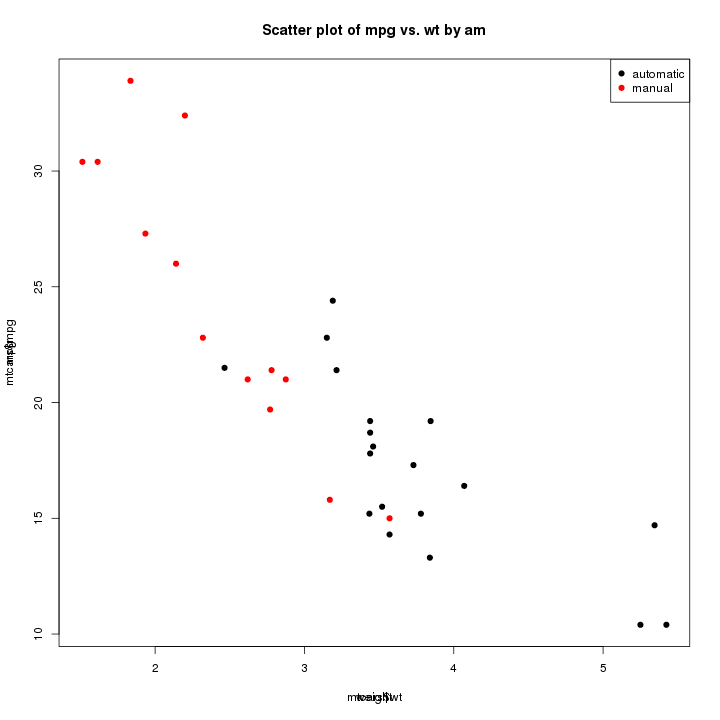

---
output:
  html_document: default
  pdf_document:
    keep_tex: yes
---
Motor Trends : Automatic or Manual transmission for better mileage ?
========================================================

**by P. Paquay**

## Executive summary

In this report we try to answer the question : "Is automatic or manual transmission better for mpg ?". To answer this question we used a dataset from the 1974 Motor Trend US magazine, and ran some statistical tests and a regression analysis. On one hand the statistical tests show (without controlling for other car design features) a difference in mean of about 7 miles more for the manual transmitted cars. On the other hand, the regression analysis indicate that, given that weight and 1/4 mile time are held constant, manual transmitted cars are $(14.079 - 4.141 \times \mathrm{weight})$ miles per gallon better than automatic transmitted cars and also that this result is significant. So for example, a 2000lb manual transmitted car can drive 5.79 more miles per gallon than a 2000lb automatic transmitted one with the same 1/4 mile time.

## Cleaning data

The first step of our analysis is simply to load and take a look at the data.


```r
data(mtcars)
str(mtcars)
```

```
## 'data.frame':	32 obs. of  11 variables:
##  $ mpg : num  21 21 22.8 21.4 18.7 18.1 14.3 24.4 22.8 19.2 ...
##  $ cyl : num  6 6 4 6 8 6 8 4 4 6 ...
##  $ disp: num  160 160 108 258 360 ...
##  $ hp  : num  110 110 93 110 175 105 245 62 95 123 ...
##  $ drat: num  3.9 3.9 3.85 3.08 3.15 2.76 3.21 3.69 3.92 3.92 ...
##  $ wt  : num  2.62 2.88 2.32 3.21 3.44 ...
##  $ qsec: num  16.5 17 18.6 19.4 17 ...
##  $ vs  : num  0 0 1 1 0 1 0 1 1 1 ...
##  $ am  : num  1 1 1 0 0 0 0 0 0 0 ...
##  $ gear: num  4 4 4 3 3 3 3 4 4 4 ...
##  $ carb: num  4 4 1 1 2 1 4 2 2 4 ...
```

Now we coerce the "cyl", "vs", "gear", "carb" and "am" variables into factor variables.


```r
mtcars$cyl <- factor(mtcars$cyl)
mtcars$vs <- factor(mtcars$vs)
mtcars$gear <- factor(mtcars$gear)
mtcars$carb <- factor(mtcars$carb)
mtcars$am <- factor(mtcars$am)
```

For a better readability, we rename the levels of the "am" variable into "Auto" and "Manual".


```r
levels(mtcars$am) <- c("Auto", "Manual")
```

## Graphics

We begin by plotting boxplots of the variable "mpg" when "am" is "Auto" or "Manual" (see Figure 1 in the appendix). This plot hints at an increase in mpg when gearing was manual but this data may have other variables which may play a bigger role in determination of mpg.

We then plot the relationships between all the variables of the dataset (see Figure 2 in the appendix). We may note that variables like "wt", "cyl", "disp" and "hp" seem highly correlated together.

## Inference

We may also run a some tests to compare the mpg means between automatic and manual transmissions.

### T-test

We begin by using a t-test assuming that the mileage data has a normal distribution.


```r
t.test(mpg ~ am, data = mtcars)
```

```
## 
## 	Welch Two Sample t-test
## 
## data:  mpg by am
## t = -3.767, df = 18.33, p-value = 0.001374
## alternative hypothesis: true difference in means is not equal to 0
## 95 percent confidence interval:
##  -11.28  -3.21
## sample estimates:
##   mean in group Auto mean in group Manual 
##                17.15                24.39
```

The test results clearly shows that the manual and automatic transmissions are significatively different.

### Wilcoxon test

Next we use a nonparametric test to determine if there's a difference in the population means.


```r
wilcox.test(mpg ~ am, data = mtcars)
```

```
## Warning: cannot compute exact p-value with ties
```

```
## 
## 	Wilcoxon rank sum test with continuity correction
## 
## data:  mpg by am
## W = 42, p-value = 0.001871
## alternative hypothesis: true location shift is not equal to 0
```

The Wilcoxon test also rejects the null hypothesis that the mileage data of the manual and automatic transmissions are from the same population (indicating a difference).

## Regression analysis

First we need to select a model, we proceed by using the Bayesian Information Criteria (BIC) in a stepwise algorithm. This algorithm does not evaluate the BIC for all possible models but uses a search method that compares models sequentially. Thus it bears some comparison to the classical stepwise method but with the advantage that no dubious p-values are used.


```r
model.all <- lm(mpg ~ ., data = mtcars)
n <- nrow(mtcars)
model.init <- step(model.all, direction = "backward", k = log(n))
```


```r
summary(model.init)
```

```
## 
## Call:
## lm(formula = mpg ~ wt + qsec + am, data = mtcars)
## 
## Residuals:
##    Min     1Q Median     3Q    Max 
## -3.481 -1.556 -0.726  1.411  4.661 
## 
## Coefficients:
##             Estimate Std. Error t value Pr(>|t|)    
## (Intercept)    9.618      6.960    1.38  0.17792    
## wt            -3.917      0.711   -5.51    7e-06 ***
## qsec           1.226      0.289    4.25  0.00022 ***
## amManual       2.936      1.411    2.08  0.04672 *  
## ---
## Signif. codes:  0 '***' 0.001 '**' 0.01 '*' 0.05 '.' 0.1 ' ' 1
## 
## Residual standard error: 2.46 on 28 degrees of freedom
## Multiple R-squared:  0.85,	Adjusted R-squared:  0.834 
## F-statistic: 52.7 on 3 and 28 DF,  p-value: 1.21e-11
```

The BIC algorithm tells us to consider "wt" and "qsec" as confounding variables. The individual p-values allows us to reject the hypothesis that the coefficients are null. The adjusted r-squared is 0.8336, so we may conclude that more than 83% of the variation is explained by the model.

However, if we take a look a the scatter plot of "mpg" vs. "wt" by transmission type (see Figure 3 in the appendix) we may notice that the "wt" variable depends on whether or not the car is automatic transmitted (as automatic transmitted cars tend to weigh more than manual transmitted ones). This fact suggests that it would be appropriate to include an interaction term between "wt" and "am".


```r
model <- lm(mpg ~ wt + qsec + am + wt:am, data = mtcars)
summary(model)
```

```
## 
## Call:
## lm(formula = mpg ~ wt + qsec + am + wt:am, data = mtcars)
## 
## Residuals:
##    Min     1Q Median     3Q    Max 
## -3.508 -1.380 -0.559  1.063  4.368 
## 
## Coefficients:
##             Estimate Std. Error t value Pr(>|t|)    
## (Intercept)    9.723      5.899    1.65  0.11089    
## wt            -2.937      0.666   -4.41  0.00015 ***
## qsec           1.017      0.252    4.04  0.00040 ***
## amManual      14.079      3.435    4.10  0.00034 ***
## wt:amManual   -4.141      1.197   -3.46  0.00181 ** 
## ---
## Signif. codes:  0 '***' 0.001 '**' 0.01 '*' 0.05 '.' 0.1 ' ' 1
## 
## Residual standard error: 2.08 on 27 degrees of freedom
## Multiple R-squared:  0.896,	Adjusted R-squared:  0.88 
## F-statistic: 58.1 on 4 and 27 DF,  p-value: 7.17e-13
```

The adjusted r-squared is now 0.8804, so we may conclude that more than 88% of the variation is explained by the model. We will choose this model as our final model.


```r
anova(lm(mpg ~ am, data = mtcars), lm(mpg ~ am + wt, data = mtcars), model.init, model)
```

```
## Analysis of Variance Table
## 
## Model 1: mpg ~ am
## Model 2: mpg ~ am + wt
## Model 3: mpg ~ wt + qsec + am
## Model 4: mpg ~ wt + qsec + am + wt:am
##   Res.Df RSS Df Sum of Sq     F  Pr(>F)    
## 1     30 721                               
## 2     29 278  1       443 101.9 1.2e-10 ***
## 3     28 169  1       109  25.1 3.0e-05 ***
## 4     27 117  1        52  12.0  0.0018 ** 
## ---
## Signif. codes:  0 '***' 0.001 '**' 0.01 '*' 0.05 '.' 0.1 ' ' 1
```

We may notice that when we compare the model with only "am" as independant variable and our chosen model, we reject the null hypothesis that the variables "wt", "qsec" and "wt:am" don't contribute to the accuracy of the model.

The regression suggests that, "wt" and "qsec" variables remaining constant, manual transmitted cars can drive 14.0794 + -4.1414 * "wt" more miles per gallon than automatic transmitted cars, and the results are statistically significant. This means that for example, a 1000lbs manual transmitted car can drive 9.9381 more miles per gallon than a same weight automatic transmitted one with the same 1/4 mile time.

## Residuals and diagnostics

### Residual analysis

We begin by studying the residual plots (see Figure 4 in the appendix). These plots allow us to verify some assumptions made before.

3. The Residuals vs Fitted plot seem to verify the independance assumption as the points are randomly scattered on the plot.
1. The Normal Q-Q plot seem to indicate that the residuals are normally distributed as the points hug the line closely.
2. The Scale-Location plot seem to verify the constant variance assumption as the points fall in a constant band.

### Leverages

We begin by computing the leverages for the "mtcars" dataset.


```r
leverage <- hatvalues(model)
```

Are any of the observations in the dataset outliers ? We find the outliers by selecting the observations with a hatvalue > 0.5.


```r
leverage[which(leverage > 0.5)]
```

```
## named numeric(0)
```

### Dfbetas

Next we look at the Dfbetas of the observations.


```r
influential <- dfbetas(model)
```

Are any of the observations in the dataset influential ? We find the influential observations by selecting the ones with a dfbeta > 1 in magnitude.


```r
influential[which(abs(influential) > 1)]
```

```
## numeric(0)
```

## Appendix

### Figure 1 : Boxplots of "mpg" vs. "am"


```r
plot(mpg ~ am, data = mtcars)
title(main = "Mpg by transmission type", xlab = "am", ylab = "mpg")
```

 

### Figure 2 : Pairs graph


```r
pairs(mtcars, panel = panel.smooth, main = "Pairs graph for MTCars")
```

 

### Figure 3 : Scatter plot of "mpg" vs. "wt" by transmission type


```r
plot(mtcars$wt, mtcars$mpg, col = mtcars$am, pch = 19, xlab = "weight", ylab = "mpg")
title(main = "Scatter plot of mpg vs. wt by am")
legend("topright", c("automatic", "manual"), col = 1:2, pch = 19)
```

 

### Figure 4 : Residual plots


```r
par(mfrow = c(2, 2))
plot(model)
```

 
